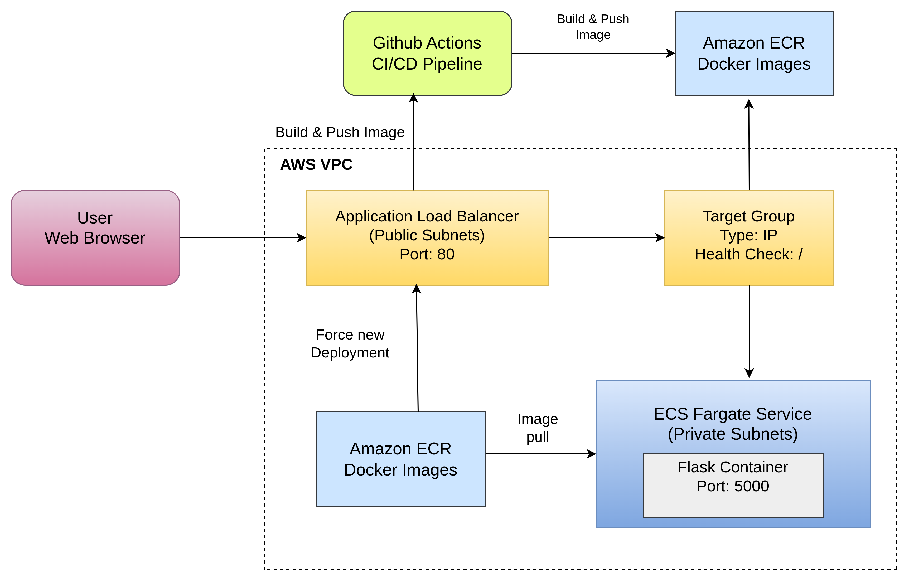

🚀 Automated Container Deployment Platform

AWS ECS Fargate | ECR | Application Load Balancer | GitHub Actions

📌 Project Overview

This project demonstrates a production-style automated container deployment platform built on AWS.
A Dockerized Flask application is deployed on Amazon ECS (Fargate), exposed via an Application Load Balancer, and automatically deployed using a GitHub Actions CI/CD pipeline.

The project focuses on real-world cloud engineering practices, including secure networking, container orchestration, CI/CD automation, and cost-efficient cloud operations.

🏗️ Architecture Overview

The platform follows a standard containerized application architecture used in modern cloud environments.

🔁 Request Flow

User
 → Application Load Balancer (Public)
 → Target Group (IP mode)
 → ECS Fargate Service (Private Subnets)
 → Dockerized Flask Application

The ALB is the only public entry point

ECS tasks run without direct internet exposure

Traffic routing is controlled by health checks

Container images are stored in Amazon ECR

🖼️ Architecture Diagram

The diagram below illustrates the high-level architecture and CI/CD workflow of the platform.

🧰 Technology Stack
☁️ Cloud Services

Amazon ECS (Fargate) – Serverless container orchestration

Amazon ECR – Secure container image registry

Application Load Balancer – Layer-7 traffic routing

Amazon VPC – Network isolation

AWS IAM – Identity and access management

🔧 DevOps Tools

Docker – Application containerization

GitHub Actions – CI/CD automation

🐍 Application

Python

Flask

🧠 Key Design Decisions
🚢 Amazon ECS Fargate

No EC2 instance management

Serverless container execution

Built-in scalability and isolation

⚖️ Application Load Balancer

Layer-7 (HTTP) routing

Native ECS integration

Health-check-based traffic forwarding

📦 Amazon ECR

AWS-native Docker registry

Secure image storage

IAM-based authentication

🔁 GitHub Actions

Git-based CI/CD automation

No additional infrastructure required

Seamless AWS integration

🔐 Security Implementation
🌐 Networking Security

ECS tasks are not directly accessible from the internet

ALB acts as the only public endpoint

Security groups enforce least-privilege access:

ALB allows HTTP (80) from the internet

ECS allows application traffic only from the ALB security group

🪪 IAM Security

ECS Task Execution Role is used to pull images from ECR

No credentials are hard-coded in source code

AWS credentials for CI/CD are securely stored in GitHub Secrets

🔄 CI/CD Pipeline
⚡ Trigger

Any push to the main branch

🛠️ Pipeline Flow

Code is pushed to GitHub

GitHub Actions pipeline is triggered

Docker image is built from source

Image is pushed to Amazon ECR

ECS service is redeployed automatically

✅ Result

Fully automated, repeatable deployments

Zero manual AWS Console interaction for application deployments

🧪 Application Details

Lightweight Flask web application

Exposes a single HTTP endpoint

Listens on port 5000

Configured to bind to 0.0.0.0 for container compatibility

✅ Deployment Validation

The deployment was validated using the following checks:

ECS service running with active tasks

Target group reporting healthy targets

Application accessible via ALB DNS endpoint

Docker image successfully stored in Amazon ECR

These checks confirm successful end-to-end deployment.

💸 Cost Management

To prevent unnecessary cloud costs, the following actions were taken after validation:

ECS service scaled down or deleted

Application Load Balancer removed

Unused Elastic IPs released

NAT Gateway removed when not required

This demonstrates cost-aware cloud engineering.

🛠️ Troubleshooting & Learnings
❗ Issue Encountered

ECS tasks failed to pull images from Amazon ECR.

🔍 Root Cause

Tasks running in private subnets lacked outbound internet access.

🧩 Resolution

Outbound connectivity was enabled and the ECS service was redeployed.

📊 Project Status

✅ Completed and validated
✅ CI/CD automation implemented
✅ Cost optimization applied

